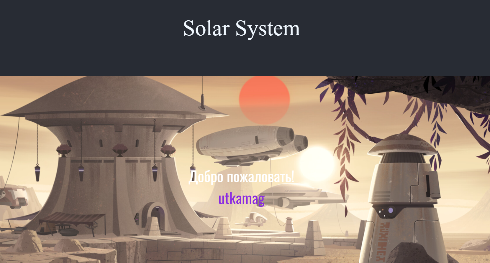

**# React_Project**

Ссылка на проект: https://project-1-5dd73.web.app/

Особенности проекта:

1) Использовалась библиотека React Router, что позволило реализовать SPA приложение (по этой причине в качестве хостинга используется google firebase hosting, а не gh pages)
2) Реализована база данных firebase realtime database (База подключена к проекту, на странице аутентификации мы записываем данные, а на главное странице мы их 
считываем. Данный процесс с одной стороны бессмысленен можно было передать данные через props, но это не так интересно :) ) 
3) Компоненты в проекте функциональные, что позвовлило использовать хуки: useState, useEffect (Особо удачно полуилось реализовать их для работы базы данных)
4) Первоначально, для заполнений форм использовалась библиотека React Hook Form, но связать с базой данных realtime firebase мне не удалось.
5) С целью стилизации проекта используется CSS, а также довольно интересная библиотека React-Parallax
